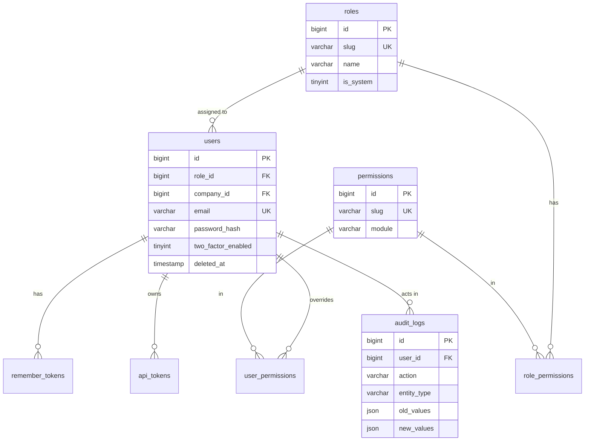
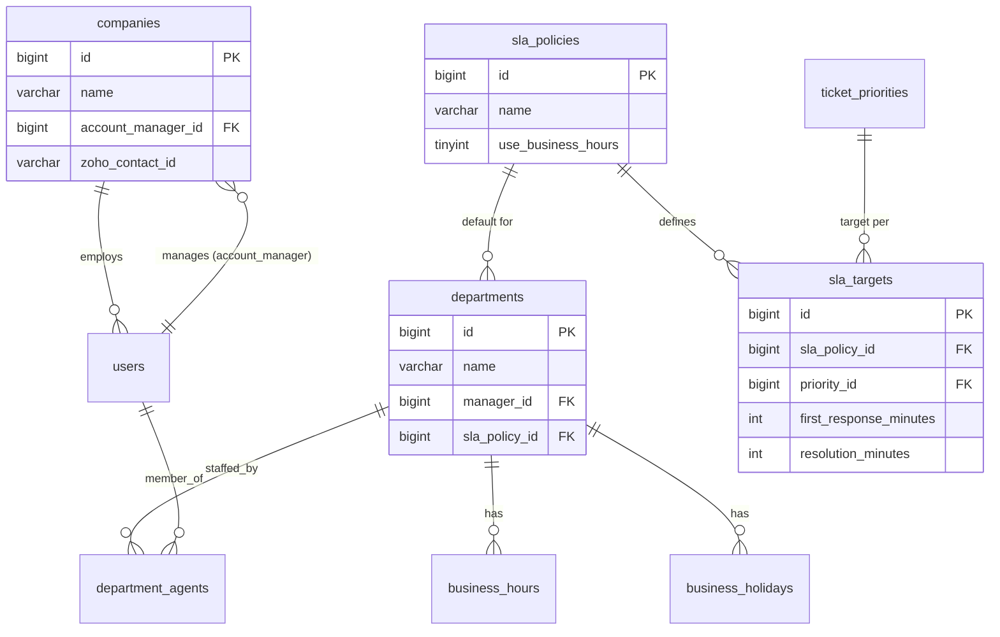
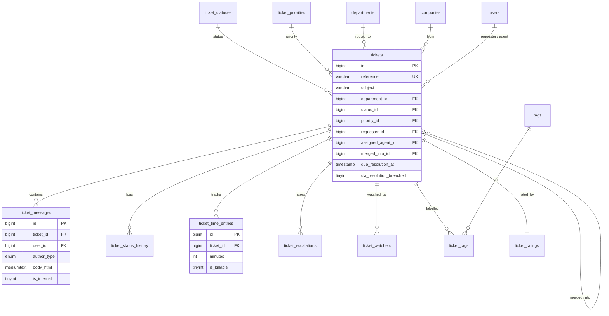
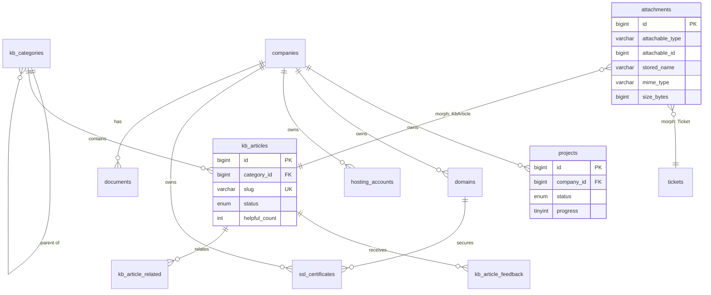
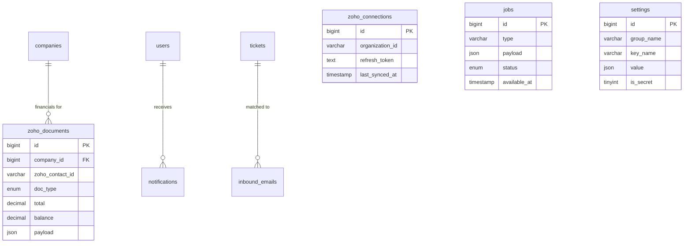

# NexusDesk — Database Design (Stage 2)

Canonical schema: [`database/schema.sql`](../../database/schema.sql) ·
Seed data: [`database/seeds/seed.sql`](../../database/seeds/seed.sql)

This stage defines the complete relational model: tables, relationships, constraints, indexes, the
ER diagrams, and the migration/seed plan. It implements every entity implied by the Stage 1
architecture and the functional spec (tickets, departments, SLA, KB, portal/workspace, Zoho cache,
notifications, email, jobs, settings, AI, RBAC, audit).

- **Engine/charset:** InnoDB · `utf8mb4` / `utf8mb4_unicode_ci` throughout.
- **48 tables** across 9 domains. Every FK is explicit; delete behaviour is chosen per relationship.

---

## 1. Design conventions

| Convention | Rule | Why |
|---|---|---|
| Primary keys | `id BIGINT UNSIGNED AUTO_INCREMENT` on every table | Uniform, room to grow, simple joins |
| Timestamps | `created_at` / `updated_at` on mutable tables; stored **UTC** | Display TZ is a presentation concern |
| Soft delete | `deleted_at` on `users, companies, tickets, kb_articles` | Preserve history/audit; nothing customer-facing is hard-deleted |
| Fixed sets | **Lookup tables** (`ticket_statuses`, `ticket_priorities`, `roles`) not ENUM | Admins can extend statuses/priorities/roles in the UI |
| Short internal enums | `ENUM(...)` for values the app owns (e.g. `source`, `author_type`, job `status`) | Never user-editable, so a code-level enum is correct and cheap |
| Money | `DECIMAL(15,2)` + `CHAR(3)` currency | Never floats for money |
| IPs | `VARBINARY(16)` (packed) | Holds IPv4 & IPv6, indexable |
| Secrets | Tokens **hashed** (`token_hash`), OAuth tokens **encrypted** app-side | Never store reversible secrets in plaintext |
| Flexible blobs | `JSON` columns (`audit_logs.old/new_values`, `zoho_documents.payload`, `settings.value`) | Schema-light where structure varies |
| Polymorphism | `attachments(attachable_type, attachable_id)` | One upload table serves tickets, KB, documents |

**Delete-behaviour policy (the important one):**
- `CASCADE` when a child cannot exist without its parent (ticket → messages, company → its projects/domains).
- `SET NULL` for optional references where history should survive (ticket → assigned agent; audit → user).
- `RESTRICT` for lookups that must not vanish under live rows (ticket → status/priority/department).

---

## 2. Domain map (the 9 sections)

| # | Domain | Key tables |
|---|---|---|
| 1 | Identity, access & security | `roles, permissions, role_permissions, users, user_permissions, password_resets, remember_tokens, login_attempts, rate_limits, audit_logs, api_tokens` |
| 2 | Clients | `companies` (+ `users.company_id`) |
| 3 | Departments, hours & SLA | `departments, department_agents, business_hours, business_holidays, sla_policies, sla_targets` |
| 4 | Help desk | `ticket_statuses, ticket_priorities, tickets, ticket_messages, ticket_status_history, ticket_time_entries, ticket_escalations, ticket_watchers, tags, ticket_tags, ticket_ratings, canned_responses` |
| 5 | Attachments | `attachments` (polymorphic) |
| 6 | Knowledge base | `kb_categories, kb_articles, kb_article_related, kb_article_feedback` |
| 7 | Client workspace | `projects, domains, hosting_accounts, ssl_certificates, documents` |
| 8 | Zoho Books cache | `zoho_connections, zoho_documents` |
| 9 | Platform | `notifications, email_templates, inbound_emails, jobs, settings, ai_requests, migrations` |

---

## 3. ER Diagrams

Rendered as grouped Mermaid diagrams (one per domain) for readability; the full FK set is in
`schema.sql`. Cardinality: `||` one, `o{` many (optional), `|{` many (required).

### 3.1 Identity & access control



### 3.2 Clients, departments & SLA



### 3.3 Help desk (tickets)



### 3.4 Knowledge base, attachments & workspace



### 3.5 Zoho cache & platform



---

## 4. Indexing strategy

Indexes are chosen from the real query paths of the app, not sprinkled blindly.

| Query path | Index |
|---|---|
| Agent queue: open tickets in a department | `idx_tickets_status_dept (status_id, department_id)` |
| "My assigned tickets" | `idx_tickets_assigned (assigned_agent_id)` |
| Customer's ticket list | `idx_tickets_requester`, `idx_tickets_company` |
| SLA monitor cron (find due/breaching) | `idx_tickets_due_res (due_resolution_at)` |
| Ticket lookup by reference (search / email threading) | `uq_tickets_reference` (unique) |
| Loading a ticket's public conversation | `idx_tmsg_ticket_internal (ticket_id, is_internal)` |
| KB full-text search | `FULLTEXT ft_kbart (title, excerpt, body_html)` |
| Notification bell (unread for a user) | `idx_notif_user_read (user_id, read_at)` |
| Job queue polling | `idx_jobs_poll (status, available_at)` |
| Login throttling | `idx_login_email_time`, `idx_login_ip_time` |
| Renewal reminders (domains/hosting/ssl) | `idx_*_expiry / renew` per table |
| Zoho document lists per client | `idx_zoho_company`, `idx_zoho_type_status` |

**Composite-order rule:** leading column is the most selective / always-present filter; range
columns (timestamps) go last so the index serves both equality and range predicates.

**Global search** (tickets, companies, KB, invoices, projects) uses: the FULLTEXT index on articles,
`reference`/`subject` indexes on tickets, `name` on companies/projects, and `number` on
`zoho_documents`. A unified search service queries each with `LIMIT` and merges results. (If a host
lacks InnoDB FULLTEXT, the KB search degrades to `LIKE` with a covering index — decided at build time.)

---

## 5. Data-integrity rules enforced in-schema

- **Uniqueness:** user email, role/permission/department/tag/category slugs, ticket reference, one
  SLA target per (policy, priority), one rating per ticket, one business-hours row per (dept, day),
  one settings row per (group, key), unique API token hash.
- **Referential integrity:** every relationship is a real FK. Lookups (`status/priority/department`)
  are `RESTRICT` so you can't delete a status that live tickets use.
- **Self-references:** `tickets.merged_into_id → tickets.id`, `kb_categories.parent_id`,
  `kb_article_related` — all guarded.
- **Circular FK handling:** `users.company_id ↔ companies.account_manager_id` is resolved by creating
  `users` first, then adding the `company_id` FK via `ALTER TABLE` after `companies` exists (see
  schema §2). Same pattern for `departments.sla_policy_id`.

Rules that belong in the **service layer** (not the DB) are documented here so they aren't forgotten:
SLA deadline computation against business hours, status-transition legality, merge/split mechanics,
permission resolution (role + overrides), and reference-number generation (`NEXUS-{n}` from settings
prefix + sequence).

---

## 6. Migration & seed plan

The installer and CI both use a tiny **migration runner** (built in Stage 6) that records applied
files in the `migrations` table.

```
database/
├── schema.sql                 # canonical full build (used by the installer for a fresh install)
├── migrations/                # incremental, ordered, forward-only changes post-launch
│   ├── 0001_baseline.sql      # == schema.sql content, tracked as batch 1
│   ├── 0002_xxx.sql           # future changes (each idempotent-guarded where practical)
│   └── ...
└── seeds/
    ├── seed.sql               # REQUIRED defaults: roles, permissions, statuses, priorities,
    │                          #   SLA, departments, business hours, email templates, settings, admin
    └── demo.sql               # OPTIONAL sample data (companies, tickets, KB, projects) for demos
```

- **Fresh install:** installer runs `schema.sql` → `seeds/seed.sql`, then records the baseline
  migration and (optionally) `demo.sql` if "install sample data" is ticked.
- **Upgrades:** the runner applies any `migrations/*.sql` not yet in the `migrations` table, in order.
- **Idempotency:** DDL migrations use `CREATE TABLE IF NOT EXISTS` / guarded `ALTER` where the target
  MySQL/MariaDB supports it; the runner wraps each file in a transaction and halts on error.
- **Seeds are safe to re-run** only for the reference sets we treat as authoritative; the installer
  seeds once on a clean DB. The demo admin's email/password are replaced by the wizard's admin step.

**Required seed contents (already written in `seed.sql`):** 5 roles with permission mappings, 23
permissions, 8 ticket statuses, 5 priorities, the Standard SLA policy with per-priority targets, 7
departments with Mon–Fri 09:00–17:00 business hours, 5 email templates, core settings (branding,
security, mail, zoho, ai), and a placeholder administrator.

---

## 7. Capacity & performance notes (shared hosting)

- `BIGINT` PKs and narrow indexes keep the working set small; the heaviest tables
  (`ticket_messages`, `audit_logs`, `jobs`, `zoho_documents`) are all indexed on their real access
  paths and are prune-able (jobs/audit retention via `cron/cleanup.php`).
- JSON columns are used only where read whole (payloads, settings) — never for values we filter on in
  hot paths.
- FULLTEXT keeps KB search off `LIKE '%...%'` table scans.
- The job queue avoids per-request latency for email/AI/Zoho and keeps web requests inside typical
  shared-hosting `max_execution_time`.

---

*End of Stage 2. Continue to Stage 3 — page inventory, navigation & user journeys.*
