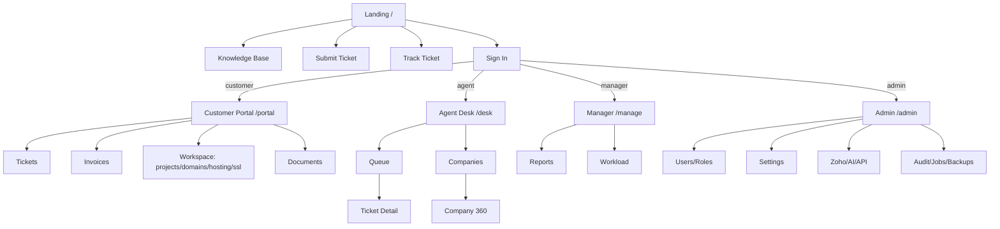

# NexusDesk — Pages, Navigation & User Journeys (Stage 3)

This stage enumerates **every page** in the application, the **navigation structure** per role, and
the **user journeys** for all five roles (Administrator, Manager, Support Agent, Customer, Guest).
It is the bridge between the data model (Stage 2) and the wireframes (Stage 4) / API (Stage 5).

Route conventions: web routes are shown as paths; `{id}` = parameter. Access column uses role slugs
(`admin, manager, agent, customer, guest`) and permissions where finer-grained.

---

## 1. Page inventory

### 1.1 Public / Guest area (no auth)

| Page | Route | Purpose | Access |
|---|---|---|---|
| Landing page | `/` | Marketing/hero, search, "Create ticket", "Track ticket", KB entry | guest |
| Knowledge base home | `/kb` | Category grid + search | guest |
| KB category | `/kb/c/{slug}` | Articles in a category | guest |
| KB article | `/kb/a/{slug}` | Article view, helpful vote, related, attachments | guest |
| KB search results | `/kb/search?q=` | Full-text results | guest |
| Submit ticket | `/submit` | Guest/customer ticket form (dept, priority, attachments) | guest |
| Ticket submitted | `/submit/success` | Confirmation + reference number | guest |
| Track ticket | `/track` | Enter reference + email to view status | guest |
| Track ticket view | `/track/{reference}` | Read-only status + conversation (email-verified) | guest |
| Sign in | `/login` | Email/password, remember me, 2FA step | guest |
| Forgot password | `/forgot-password` | Request reset link | guest |
| Reset password | `/reset-password/{token}` | Set new password | guest |
| Error pages | `403/404/419/429/500/503` | Friendly branded errors | all |
| Health check | `/health` (API) | System status ping | internal |

### 1.2 Customer portal (role: customer)

| Page | Route | Purpose |
|---|---|---|
| Portal dashboard | `/portal` | KPIs (open tickets, invoices due, renewals), recent activity, quick actions |
| My tickets | `/portal/tickets` | Filterable list (open/closed), status chips |
| Ticket detail | `/portal/tickets/{id}` | Conversation, reply, attachments, close, print, rate |
| New ticket | `/portal/tickets/new` | Authenticated create form |
| Knowledge base | `/portal/kb` | Same KB, customer-visible articles included |
| Invoices | `/portal/invoices` | Zoho invoices, balance, status, PDF |
| Invoice detail | `/portal/invoices/{id}` | Line items + download PDF (streamed) |
| Quotes | `/portal/quotes` | Zoho quotes/estimates |
| Statements | `/portal/statements` | Account statement + PDF |
| Projects | `/portal/projects` | Project list + progress |
| Project detail | `/portal/projects/{id}` | Status, timeline, documents |
| Domains | `/portal/domains` | Domain list, expiry, renewal status |
| Hosting | `/portal/hosting` | Hosting accounts, usage, renewal |
| SSL | `/portal/ssl` | Certificates, expiry status |
| Documents / Downloads | `/portal/documents` | Contracts, deliverables, guides |
| Notifications | `/portal/notifications` | Full notification history |
| Profile & security | `/portal/profile` | Details, password, 2FA, theme |
| Company workspace | `/portal/company` | The client "business dashboard" aggregating all of the above |

### 1.3 Agent / staff area (roles: agent, manager, admin)

| Page | Route | Purpose |
|---|---|---|
| Agent dashboard | `/desk` | My queue, SLA at-risk, unassigned, today's stats |
| Ticket list / queue | `/desk/tickets` | Powerful filters (dept, status, priority, agent, tag, SLA), saved views, bulk actions |
| Ticket detail | `/desk/tickets/{id}` | Full agent workspace (see §3.3) |
| New ticket (on behalf) | `/desk/tickets/new` | Agent creates for a customer |
| Companies | `/desk/companies` | Client list |
| Company detail | `/desk/companies/{id}` | 360° view: contacts, tickets, finance, projects, assets |
| Customers/contacts | `/desk/contacts` | People directory |
| Contact detail | `/desk/contacts/{id}` | Person view + their tickets |
| Knowledge base (manage) | `/desk/kb` | Article/category CRUD, publish |
| KB editor | `/desk/kb/articles/{id}/edit` | Rich editor, media, related, visibility |
| Canned responses | `/desk/canned` | Macro library |
| Notifications | `/desk/notifications` | Staff notification history |
| Global search results | `/desk/search?q=` | Cross-entity results |
| Profile & security | `/desk/profile` | Own settings |

### 1.4 Manager area (role: manager, admin) — extends staff area

| Page | Route | Purpose |
|---|---|---|
| Manager dashboard | `/manage` | Department health, SLA compliance, agent workload |
| Reports home | `/manage/reports` | Report catalogue |
| Ticket volume report | `/manage/reports/volume` | Trends by dept/period (Chart.js) |
| SLA report | `/manage/reports/sla` | Compliance, breaches, at-risk |
| Agent performance | `/manage/reports/agents` | Resolution time, volume, CSAT per agent |
| CSAT report | `/manage/reports/satisfaction` | Ratings distribution & comments |
| Department performance | `/manage/reports/departments` | Cross-dept comparison |
| Resolution-time report | `/manage/reports/resolution` | Time-to-resolve analysis |
| Assignments / workload | `/manage/workload` | Live agent load & rebalancing |
| Export (any report) | `?export=pdf|xlsx|csv` | Server-side export |

### 1.5 Administrator area (role: admin)

| Page | Route | Purpose |
|---|---|---|
| Admin dashboard | `/admin` | System overview + health (DB, mail, Zoho, cron, queue) |
| Users | `/admin/users` | User CRUD, role, activate/deactivate |
| User detail/edit | `/admin/users/{id}` | Profile, role, permission overrides, 2FA reset |
| Roles & permissions | `/admin/roles` | Role CRUD + permission matrix |
| Departments | `/admin/departments` | Dept CRUD, manager, email, hours, SLA |
| SLA policies | `/admin/sla` | Policy + per-priority targets |
| Statuses & priorities | `/admin/workflow` | Manage lookup sets, colours, behaviour |
| Tags | `/admin/tags` | Tag management |
| Email settings (SMTP) | `/admin/settings/mail` | SMTP config + test send |
| Email templates | `/admin/settings/templates` | Template editor with variables |
| Inbound email | `/admin/settings/inbound` | Pipe/IMAP config, inbound log |
| Branding | `/admin/settings/branding` | Name, logo, colours, theme |
| General settings | `/admin/settings/general` | Timezone, date format, locale, ticket prefix |
| Security settings | `/admin/settings/security` | Sessions, lockout, 2FA policy, rate limits |
| Zoho Books | `/admin/settings/zoho` | Connect/OAuth, org, sync status, contact mapping |
| AI settings | `/admin/settings/ai` | Provider selection, feature toggles, usage log |
| API tokens | `/admin/settings/api` | Token management, docs link |
| Modules | `/admin/settings/modules` | Enable/disable modules (extension point) |
| Audit log | `/admin/audit` | Filterable audit trail |
| Jobs / queue | `/admin/jobs` | Queue depth, failures, retry |
| Backups | `/admin/backups` | Create/download/restore, schedule |
| System status | `/admin/status` | Health, disk, versions, cron last-run |

### 1.6 Installer (pre-install only, self-locks)

`/installer.php` — steps: Requirements → Database → Migrate/Seed → Admin account → SMTP → Company/Branding → Finish.

**Total: ~90 distinct pages/screens across the six areas.**

---

## 2. Navigation structure

### 2.1 Shell layout (authenticated)

```
┌───────────────────────────────────────────────────────────────────────┐
│  TOPBAR:  [≡] Logo   |   Global Search ⌕   |   🔔(3)  🌗theme  ▾Profile │
├───────────┬───────────────────────────────────────────────────────────┤
│  SIDEBAR  │                                                             │
│ (role-    │   PAGE CONTENT (breadcrumbs → title → actions → body)        │
│  aware)   │                                                             │
└───────────┴───────────────────────────────────────────────────────────┘
```
- **Sidebar items are contributed per module and filtered by permission** (Stage 1 `MenuRegistry`).
  A customer never sees the agent sidebar; an agent without `reports.view` never sees Reports.
- **Global search** and **notification centre** live in the topbar on every authenticated page.
- Mobile: sidebar collapses to an off-canvas drawer; topbar stays.

### 2.2 Sidebar per role

| Customer | Agent | Manager (adds) | Admin (adds) |
|---|---|---|---|
| Dashboard | Dashboard | Manager dashboard | Admin dashboard |
| My Tickets | Ticket Queue | Reports (all) | Users |
| Knowledge Base | Companies | Workload | Roles & Permissions |
| Invoices | Contacts | | Departments / SLA / Workflow |
| Quotes / Statements | Knowledge Base | | Settings (mail, branding, security…) |
| Projects | Canned Responses | | Zoho / AI / API / Modules |
| Domains / Hosting / SSL | Search | | Audit / Jobs / Backups / Status |
| Documents | | | |
| Notifications / Profile | Notifications / Profile | | |

### 2.3 Site map (high-level flow)



---

## 3. User journeys

### 3.1 Guest → Customer: submit and track a ticket

1. Lands on `/`, searches the KB → doesn't find an answer.
2. Clicks **Create ticket** → `/submit`. Fills subject, department, priority, message, attachments.
3. Client + server validation; CSRF + rate-limit + attachment scan pass.
4. `TicketService` creates the ticket (`source=portal`), generates `NEXUS-{n}`, resolves SLA
   deadlines, fires `TicketCreated` → queues confirmation email + agent notification.
5. Redirect to `/submit/success` with the reference; confirmation email arrives.
6. Later, guest goes to `/track`, enters reference + email → verified → sees status & conversation.
7. If the guest email matches/creates a customer account, they can register to get the full portal.

**Acceptance:** ticket persisted, reference unique, SLA deadlines set, email queued, appears in the
agent queue within one queue-poll cycle.

### 3.2 Customer: portal lifecycle

1. Signs in → `/portal` dashboard: open tickets, invoices due, upcoming renewals, recent activity.
2. Opens a ticket → replies with an attachment → status flips to reflect customer reply; agent notified.
3. Checks **Invoices** (Zoho-backed) → opens one → downloads the PDF (streamed via guarded controller).
4. Reviews **Domains/SSL** → sees an expiry warning badge on a domain 20 days out.
5. When a ticket is resolved, receives an email → returns to **rate** support (1–5 + comment).
6. Manages **Profile**: enables 2FA, switches to dark theme, updates contact details.

### 3.3 Support Agent: work a ticket (the core workspace)

The agent ticket detail (`/desk/tickets/{id}`) is the app's most important screen:

- **Left/main:** conversation thread (customer messages + agent replies + system events), reply box
  with rich text, canned-response insert, attachment upload, and an **internal-note** toggle (yellow,
  hidden from customer).
- **Right rail:** requester + company card (with finance snapshot), status/priority selectors,
  assignee, department, tags, SLA timers (first-response & resolution countdown with breach state),
  time-tracking widget, watchers, and ticket actions.
- **Actions:** reply, assign/reassign, **transfer** (dept change), **escalate** (to manager/agent),
  **merge** (into another ticket) / **split** (spin a message into a new ticket), change status,
  add internal note, log time, add tag, print, close.
- **AI touchpoints (stubbed now):** "Summarise thread", "Suggest reply", "Detect sentiment",
  "Suggest KB article", "Rewrite/translate reply" — each calls its AI service, which returns
  placeholder output from `NullAiProvider` until a provider is wired.

**Journey:** pick from queue → read → (optionally) summarise → reply or note → set status
(`In Progress`/`Pending Customer`) → log time → resolve. Each action writes history + audit and fires
events (notifications, SLA recompute).

### 3.4 Manager: oversight

1. `/manage` dashboard: department SLA compliance %, breaches, backlog, agent workload heatmap.
2. Opens **SLA report** → filters by department + last 30 days → sees at-risk tickets → drills in.
3. **Workload** page → notices an overloaded agent → reassigns/rebalances tickets.
4. **Agent performance** → reviews resolution time & CSAT → exports PDF for a stakeholder.

### 3.5 Administrator: configure the system

1. `/admin` health overview (DB/mail/Zoho/cron/queue all green).
2. Creates a department (email, manager, business hours, SLA), adds agents.
3. Configures **SMTP** → sends a **test email**; edits an **email template**.
4. Connects **Zoho Books** (OAuth) → maps a company to its Zoho contact → triggers a sync.
5. Manages **users/roles**, sets a **permission override**, enforces 2FA for admins.
6. Adjusts **branding** (logo, colours) → the whole UI re-themes from settings, no code change.
7. Reviews **audit log**, runs a **backup**, checks **jobs** for failures.

### 3.6 First-run: installation

Admin visits `/installer.php` → requirements check (PHP 8.3, extensions, writable dirs) → DB details →
runs schema + seed → creates the real admin account → SMTP → company name/logo/colours → **Finish**
(writes `.env`, drops `storage/installed.lock`, redirects to `/login`; installer refuses to run again).

---

## 4. Cross-cutting UX rules

- **Every list**: search + filters + sort + pagination + empty-state + bulk actions where relevant.
- **Every destructive action**: confirmation modal; soft-delete where the data model supports it.
- **Every form**: inline validation, disabled-during-submit, success/error toasts, CSRF token.
- **Every role**: sees only permitted nav items and is redirected to its own home after login.
- **Notifications**: bell with unread count (polled), toast on new events, full history page, plus email.
- **Responsive**: all tables become stacked cards on mobile; the agent workspace collapses the right
  rail into an accordion.
- **Accessibility**: keyboard-navigable, ARIA on interactive widgets, AA contrast in both themes.

---

*End of Stage 3. Continue to Stage 4 — wireframes & design system.*
